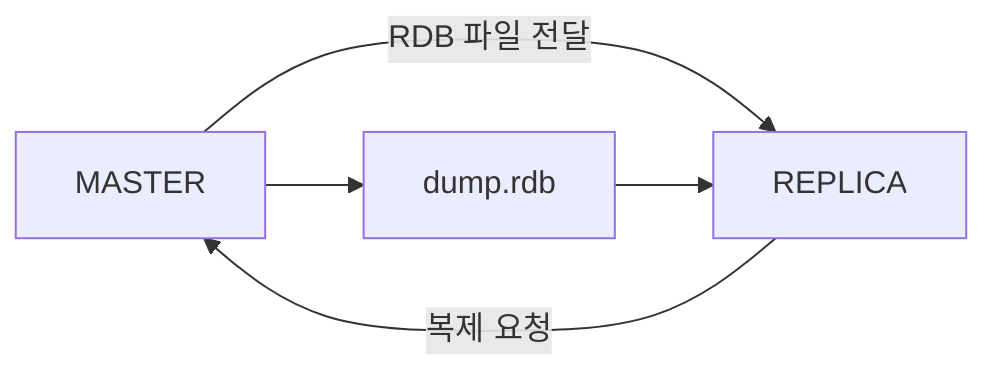
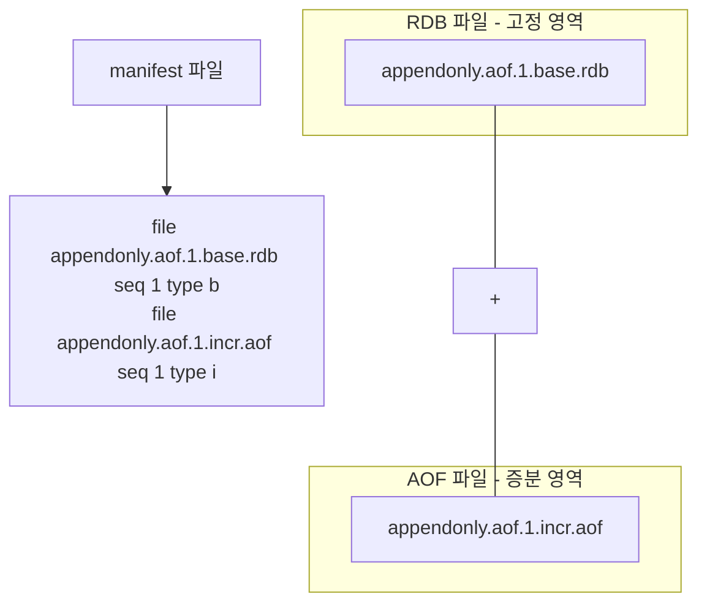
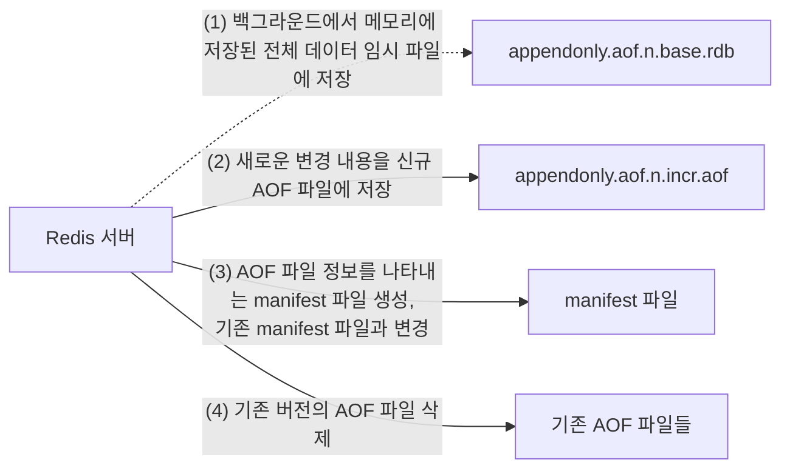
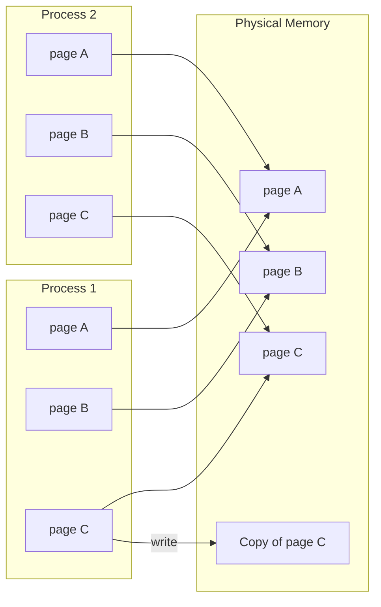

# Redis Data Backup

레디스를 캐시가 아닌 영구 저장소와 같은 용도로 사용한다면 디스크에 데이터를 주 기적으로 백업하는 것이 안전하다. 데이터를 안전하게 저장하기 위해 레디스에서는 RDB와 AOF 두 가지의 백업 방식을 지원한다.

복제(REPLICATION) 는 가용성을 위함  
백업(BACKUP) 은 장애 상황에서 데이터의 복구  

- RDB(Redis DataBase): 일정 시점에 메모리에 저장된 데이터 전체를 저장(snapshot 방식)
- AOF(Append Only File): 레디스 인스턴스가 처리한 모든 쓰기 작업을 차례대로 기록. 복원 시에는 파일을 다시 읽어가며 데이터 세트 재구성

RDB 파일은 바이너리 형태로 저장돼 우리가 읽고 해석할 수 없는 형태이며  
AOF 파일은 레디스 프로토콜(RESP) 형태로 저장된다

- RDB 파일의 경우, 시점 단위로 여러 백업본을 저장할 수 있고 AOF 파일보다 복원이 빠르다는 장점이 있지만 특정 시점으로의 복구는 불가능하다. 
- AOF는 RDB 파 일보다 크기가 크고 주기적으로 압축해 재작성해야 하지만, 원하는 시점으로 복구할 수 있다는 장점이 있다.

하나의 인스턴스에서 RDB와 AOF 옵션을 동시에 사용하는것도 가능  
일반적인 RDB만큼의 데이터 안정성을 원하는 경우 두 가지 백업 방식을 동시에 사용하기를 권장한다  
데이터 복원시 AOF 파일이 존재하면 레디스는 더 안전하다고 판단되는 AOF 파일을 복원 시 사용하지만 데이터의 안정성을 위해서는 주기적인 RDB 스냅숏을 갖는것이 좋기 때문  

## 자동 RDB 백업

```conf
dir <RDB 파일이 저장될 경로>
dbfilename <RDB 파일 이름> # default: dump.rdb

save <기간(초)> <기간 내 변경된 키의 개수>
```

```conf
save 900 1
# 900초 동안 1개 이상의 키가 변경된 경우
save 300 10
# 300초 동안 10개 이상의 키가 변경된 경우 
save 60 10000
# 60초 동안 10000개 이상의 키가 변경된 경우
```

RDB 파일을 저장하고 싶지 않다면 아래와 같이 설정한다
```conf
save ""
```

이미 레디스 인스턴스가 실행 중인 상태에서 RDB 저장을 비활성화 하고 싶다면 

```bash
redis-cli

# 현재 적용된 save 옵션 확인
> CONFIG GET save
1) "save"
2) "900 1 300 10 60 10000"

# save 옵션 초기화
> CONFIG SET save ""
OK

# redis.conf 파일 재작성
# 설정 파 일을 재작성하지 않은 상태에서 레디스 인스턴스가 재시작된다면 레디스 인스턴스는 기존 설정 파일에 작성된 옵션, 즉 변경되지 않은 옵션 값으로 설정된다.
> CONFIG REWRITE
OK
```

### 수동 RDB 파일 생성

SAVE - 동기식으로 파일을 저장  
- 일반적인 운영환경에서는 SAVE 커맨드를 되도록 사용하지 않는 것이 좋다

BGSAVE - 백그라운드에서 RDB 파일을 생성한 뒤 종료  
- fork를 호출해 자식 프로세스를 생성하며 생성된 자식 프로세스가 백그라운드에서 RDB 파일 생성  
- 이미 백그라운드에서 데이터가 저장되고 있을 때 수행시 에러 반환
- SCHEDULE 옵션을 사용하면 기존 진행중이던 백업이 완료 되었을 때 다시 BGSAVE 실행

LASTSAVE - RDB 파일이 정상적으로 저장되었는지 확인
- 마지막으로 RDB 파일이 저장된 시점을 유닉스 타임스탬프로 반환 

### 복제 사용시 자동으로 RDB 파일 생성



복제본(REPLICA)에서 REPLICAOF 커맨드를 이용해 복제를 요청하면 마스터 노드에서는 RDB 파일을 새로 생성해 복제본에게 전달  

네트워크 등의 이슈로 일정 시간 이상 복제가 끊어졌다가 복구된 경우 복제 재연결이 발생  
이럴 경우에도 마스터 노드는 복제본으로 RDB 파일을 전송

## AOF 백업

```conf
appendonly yes # AOF 파일 활성화 
appendfilename "appendonly.aof" # appenddirname 하위 생성
appenddirname "appendonlydir" # dir 하위 생성
```

버전 7.0 이상부터 AOF 파일은 여러 개로 저장  


### AOF 파일 재구성 방법

AOF는 Append-Only File이라는 이름 뜻 그대로 실행되는 커맨드가 파일의 뒤쪽 에 계속 추가되는 방식으로 동작한다. 따라서 인스턴스가 실행되는 시간에 비례해서 AOF 파일의 크기는 계속 증가하게 된다.

따라서 점점 커지는 파일을 주기적으로 압축시키는 재구성(rewrite) 작업이 필요하다  


재구성은 기존에 디스크에 저장됐던 AOF 파일을 사용하는것이 아니라 레디스 메모리에 있는 데이터를 읽어와서 새로운 파일로 저장하는 형태로 동작  
`aof-use-rdb-preamble yes` 일때 데이터는 RDB 파일 형태로 저장  

AOF 파일 재구성도 fork를 이용해 자식 프로세스를 생성하여 재구성  


[[redisgate]Redis AOF-USE-RDB-PREAMBLE Parameter](https://redisgate.kr/redis/configuration/param_aof-use-rdb-preamble.php)

```conf
aof-use-rdb-preamble yes # default yes
```

no 변경시 베이스 파일은 *.base.rdb 형태가 아닌 *.base.aof 이름으로 저장, 저장되는 형태도 RESP 프로토콜 형태의 텍스트로 변경  




버전 7 이후, AOF는 기본이 되는 바이너리 형태 RDB 파일, 증가하는 RESP 의 텍스트 형태의 AOF 파일로 나눠서 데이터를 관리  
또한 현재 레디스가 바라보고 있는 파일이 어떤 것인지 나타내는 매니페스트 파일을 도입  

AOF가 재구성될 때마다 AOF를 구성하고 있는 각 RDB와 AOF의 파일명 번호, 그리고 메니페스트 파일 내부의 seq 값도 1씩 증가

```bash
ll dir/appendonlydir/
```

```log
-rw-rw-r-- 1 ubuntu ubuntu  125 Dec 10 17:09 appendonly.aof.2.base.rdb
-rw-r--r-- 1 ubuntu ubuntu 1555 Dec 10 23:40 appendonly.aof.2.incr.aof
-rw-r--r-- 1 ubuntu ubuntu  106 Dec 10 17:09 appendonly.aof.manifest
```

```bash
cat appendonly.aof.manifest 
```

```log
file appendonly.aof.2.base.rdb seq 2 type b
file appendonly.aof.2.incr.aof seq 2 type i startoffset 25404
```

버전 7 이후 AOF 재구성 실행 과정



- (1) 레디스 인스턴스는 fork를 이용해 자식 프로세스를 생성한다. 생성된 자식 프로 세스는 레디스 메모리의 데이터를 읽어와 신규로 생성한 임시 파일에 저장한다.
- (2) 백그라운드로 (1)의 과정이 진행되는 동안 레디스 메모리의 데이터가 변경된 내역은 신규 AOF 파일에 저장된다.
- (3) (1)의 AOF 재구성 과정이 끝나면 임시 매니페스트 파일을 생성한 뒤, 변경된 버전으로 매니페스트 파일 내용을 업데이트한다.
- (4) 생성된 임시 매니페스트 파일로 기존 매니페스트 파일을 덮어 씌운 뒤, 이전 버 전의 AOF,RDB 파일들을 삭제한다.

### 자동 AOF 재구성

```conf
auto-aof-rewrite-percentage 100 # (default)
auto-aof-rewrite-min-size 64mb # (default)
```

```bash
redis-cli

127.0.0.1:6379> INFO Persistence
# Persistence
...
...
aof_current_size:186830
aof_base_size:145802 # 마지막으로 저장된 AOF 파일 크기 
```

위의 예제에서 현재의 aof_base_size는 145802이고, aof_current_size는 186830이다.
auto-aof-rewrite-percentage가 100이라면 aof_current_size가 aof_base_size의 100%만큼 커진 291604가 되면 자동으로 재구성을 시도한다.

데이터가 아무것도 없는 상태로 인스턴스가 처음 부팅됐을 때의 aof_base_size는 0이므로, 이럴 때에는 auto_aof_rewrite_min_size를 기준으로 데이터를 재구성한다.

auto-aof-rewrite-min-size 옵션은 재구성된 이후의 AOF 파일의 최소 크기를 지정할 수 있다. 사용자가 데이터를 생성하고 삭제하는 작업을 반복했다고 생각해보자. 실제로 재구성를 시도해 새로 저장된 RDB 파일의 크기, 즉 aof_base_size가 1KB로 줄어 드는 경우가 발생할 수 있다. 이 경우 aof_current_size가 1KB의 100%에 도달할 때 마다 재구성을 시도해야 하는 상황이 발생할 수 있으며, 이는 비효율적인 작업을 트리 거할 수 있다.

따라서 마지막으로 작성된 AOF 파일 크기를 기준으로 재구성하되, 적어도 AOF 파일 이 특정 크기 이상일 때에만 재구성를 하도록 지정해 비효율적인 작업을 최소화할 수 있다.

### 수동 AOF 재구성

BGREWRITEAOF 커맨드를 이용하면 원하는 시점에 직접 AOF 파일을 재구성할 수 있다.
자동으로 재구성할 때와 동일하게 동작한다.

### AOF 타임스탬프

버전 7 이상부터는 AOF를 저장할 때 타임스탬프를 남길 수 있다 

```conf
aof-timestamp-enabled yes (default: no)
```

AOF 데이터가 저장될 때 타임스탬프도 함께 저장

```log
#TS:1669532240
*2
$6
SELECT
...
```

이를 이용하면 수동으로 AOF 파일을 조작하지 않아도 시스템상에서 시점 복원Point-in-time recovery이 가능하다. 만약 사용자의 실수로 FLUSHALL 커맨드를 사용해 레디스의 모든 데이터를 삭제했다고 가정해보자. AOF 파일에는 다음과 같은 로그가 남게 된다.

```
#TS:1669532240
*2
$6
SELECT
$1
0
*3
$3
set
$1
a
$1
b
#TS: 1669532845
*2
$6
SELECT
$1
0
*1
$8
flushall
```

레디스에서 제공하는 redis-check-aof 프로그램을 사용해 FLUSHALL이 실행되 기 전까지로 데이터를 복구할 수 있다. 예제에서는 리눅스 타임스탬프를 1669532845로 돌려봤다.

```bash
redis-check-aof -truncate-to-timestamp 1669532845 appendonlydir/appendonly.aof.manifest
```

이후 aof 파일 확인시 다음과 같이 flushall 커맨드가 수행되기 전까지 데이터가 AOF 파일에 남아 있게 된다

```bash
cat appendonly.aof.15.incr.aof
```

```
#TS:1669532240
*2
$6
SELECT
$1
0
*3
$3
set
$1
a
$1
b
```

## 백업 사용시 주의점 

RDB, AOF 파일을 사용하는 경우 인스턴스의 maxmemory 값은 실제 서버 메모리보다 여유를 갖고 설정하는 것이 좋다  

BGSAVE 커맨드로 RDB 파일을 저장하거나 AOF 재구성을 진행할 때 레디스는 fork() 를 이용해 자식 프로세스를 생성  
생성된 자식 프로세스는 레디스의 메모리를 그대로 파일에 저장해야 하며, 기존의 부모 프로세스는 다른 메모리의 데이터를 이용해 다른 클라이언트의 연결을 처리해야 한다  
이때 레디스는 Copy-On-Write(COW) 방식을 이용해 메모리상의 데이터를 하나 더 복사하는 방법을 이용해 백업을 진행하면서도 클라이언트의 요청 사항을 받아 메모리의 데이터를 읽고 수정하는 작업을 진행할 수 있다

하지만 물리적 메모리에 있는 실제 메모리 페이지가 그대로 복제되기 때문에 최악의 경우 레디스는 기존 메모리 용량의 2배를 사용하게 될 수도 있다.  
maxmemory 값을 너무 크게 설정한 경우, 레디스의 copy-on-write 동작으로 인해 OS 메모리가 가득 차는 상황이 발생하여 OOM(Out Of Memory) 문제로 서버가 다운될 수 있다  



따라서 레디스의 maxmemory 옵션은 실제 메모리보다 여유를 갖고 설정하는 것이 안정적이다.  
다음 표와 같이 서버의 메모리 유형에 따라 적절한 maxmemory 값을 지정하는 것이 좋다

| RAM  | Maxmemory | 비율 |
|------|-----------|------|
| 2GB  | 638MB     | 33%  |
| 4GB  | 2048MB    | 50%  |
| 8GB  | 4779MB    | 58%  |
| 16GB | 10240MB   | 63%  |
| 32GB | 21163MB   | 65%  |
| 64GB | 43008MB   | 66%  |

RDB 스냅숏을 저장하는 도중엔 AOF의 재구성 기능을 사용할 수 없고, AOF 재구성 이 진행될 때에는 BGSAVE를 실행할 수 없다.