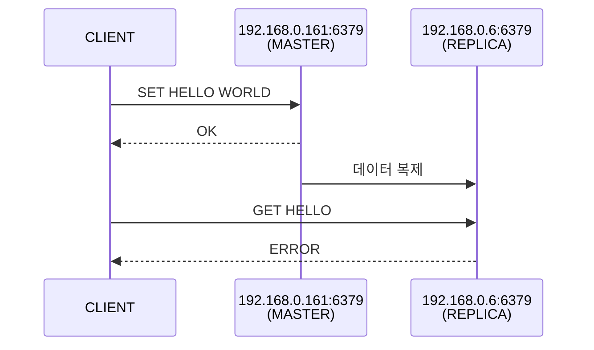

# 복제본을 이용한 읽기 성능 향상

레디스 클라이언트는 기본적으로 키를 요청하면 키를 갖고 있는 마스터 노드로 연결을 리디렉션한다. 마스터에 연결된 복제본 노드는 같은 데이터를 갖고 있기 때문에 키를 읽을 수 있지만, 이 경우에도 우선 마스터로 연결이 변경된다.

`MASTER-1(rm1, 192.168.0.161) - REPLICA-2(rr2, 192.168.0.6)`



데이터를 가지고 있는 rr2 노드에서 데이터를 읽어오려 할 때 에러가 발생  
만약 클러스터를 지원하는 클라이언트를 사용할 경우에는 마스터로 리디렉션 된다  

```bash
redis-cli -a redis -c

127.0.0.1:6379> set hello world
-> Redirected to slot [866] located at 192.168.0.161:6379
OK
```

```bash
redis-cli -a redis -h rr2

rr2:6379> get hello
(error) MOVED 866 192.168.0.161:6379
```

```bash
redis-cli -a redis -h rr2 -c

rr2:6379> get hello
-> Redirected to slot [866] located at 192.168.0.161:6379
"world"
```

경우에 따라 애플리케이션의 읽기 성능 향상을 위해 복제본 노드를 읽기 전용으로 사용하고 싶을 수 있다. 
마스터에 데이터를 읽어가는 부하가 집중되는 경우 데이터를 쓰는 커넥션은 마스터에, 읽기는 복제본에서 수행할 수 있도록 커넥션을 분배시킨다면 읽기 성능을 향상시킬 수 있다.

이런 경우 다음과 같이 복제본으로 맺어지는 커넥션을 READONLY 모드로 변경해 클라이언트가 복제본 노드에 있는 데이터를 직접 읽을 수 있게 할 수 있다.

```bash
redis-cli -a redis -h rr2 -c

rr2:6379> readonly
OK
rr2:6379> get hello
"world"
```

ref) [[redisgate] Redis REPLICA-READ-ONLY Parameter](https://redisgate.kr/redis/configuration/param_replica-read-only.php)
