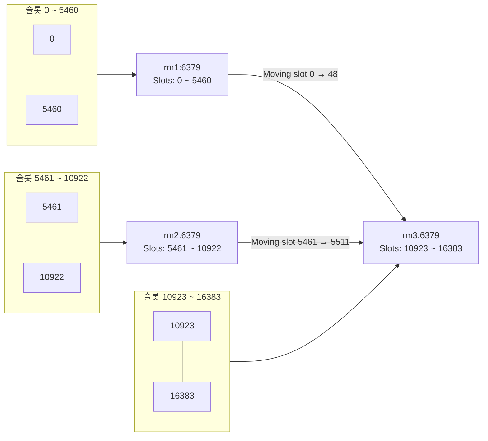

# 클러스터 리샤딩

마스터 노드 해시슬롯 중 일부를 다른 마스터로 이동하는것을 리샤딩이라 한다  
redis-cli 에서 cluster reshard 옵션을 이용해 수행  

```bash
redis-cli --cluster reshard rm3 6379
```

```log
>>> Performing Cluster Check (using node rm3:6379)
M: c0633bb7f70ea797723a10c3a7b42844ada479e8 rm3:6379
   slots:[10923-16383] (5461 slots) master
   1 additional replica(s)
S: e555b3ff50826cea2bbced34bc9cc2816350ac94 192.168.0.6:6379
   slots: (0 slots) slave
   replicates d527972515b60af3a50464f423459ac66420e4d6
M: d527972515b60af3a50464f423459ac66420e4d6 192.168.0.161:6379
   slots:[0-5460] (5461 slots) master
   1 additional replica(s)
S: 2852d7d909af7c163e5d5644174359de2513da37 192.168.0.162:6379
   slots: (0 slots) slave
   replicates c0633bb7f70ea797723a10c3a7b42844ada479e8
S: c31e8130189075a6e705ed6e72fc0c7c66cc478f 192.168.0.182:6379
   slots: (0 slots) slave
   replicates 61a647c502097cd32a6dfd343da9eafc2e0018bb
M: 61a647c502097cd32a6dfd343da9eafc2e0018bb 192.168.0.13:6379
   slots:[5461-10922] (5462 slots) master
   1 additional replica(s)
[OK] All nodes agree about slots configuration.
>>> Check for open slots...
>>> Check slots coverage...
[OK] All 16384 slots covered.
How many slots do you want to move (from 1 to 16384)? 
```

reshard 실행시 클러스터 구조 파악한 뒤 연결된 다른 노드의 정보를 찾아와 다음과 같이 보여준다  
이때 마스터 노드 뿐 아니라 레플리카 노드 중 하나를 지정하더라도 리샤딩 동작은 동일하게 수행된다  

100개의 키를 이동시켜보자  

```log
How many slots do you want to move (from 1 to 16384)? 100
What is the receiving node ID? 
```

이제 이 해시슬롯을 받을 노드의 ID를 입력한다  
노드의 ID는 리샤딩을 시작했을 때 파악한 구성에서 쉽게 확인할 수 있다  
rm3 노드에 100개의 해시슬롯을 이동시키고 싶다면 다음과 같이 입력한다

```log
How many slots do you want to move (from 1 to 16384)? 100
What is the receiving node ID? c0633bb7f70ea797723a10c3a7b42844ada479e8
Please enter all the source node IDs.
  Type 'all' to use all the nodes as source nodes for the hash slots.
  Type 'done' once you entered all the source nodes IDs.
Source node #1: 
```

이제 해시슬롯을 이동시킬 노드의 ID를 묻는 메세지가 표시된다  
- all - 모든 마스터 노드에서 조금씩 이동할 것을 의미
- done - 해시슬롯을 가져올 마스터 ID를 지정하고 싶다면 하나씩 입력한 뒤 done을 입력해주면 된다

아래는 all 입력시 다른 노드에서 조금씩 슬롯을 가져오는 상황을 나타낸다  



```log
Source node #1: all

Ready to move 100 slots.
  Source nodes:
    M: d527972515b60af3a50464f423459ac66420e4d6 192.168.0.161:6379
       slots:[0-5460] (5461 slots) master
       1 additional replica(s)
    M: 61a647c502097cd32a6dfd343da9eafc2e0018bb 192.168.0.13:6379
       slots:[5461-10922] (5462 slots) master
       1 additional replica(s)
  Destination node:
    M: c0633bb7f70ea797723a10c3a7b42844ada479e8 rm3:6379
       slots:[10923-16383] (5461 slots) master
       1 additional replica(s)
  Resharding plan:
    Moving slot 5461 from 61a647c502097cd32a6dfd343da9eafc2e0018bb
    Moving slot 5462 from 61a647c502097cd32a6dfd343da9eafc2e0018bb
    Moving slot 5463 from 61a647c502097cd32a6dfd343da9eafc2e0018bb
    Moving slot 5464 from 61a647c502097cd32a6dfd343da9eafc2e0018bb
    Moving slot 5465 from 61a647c502097cd32a6dfd343da9eafc2e0018bb
    Moving slot 5466 from 61a647c502097cd32a6dfd343da9eafc2e0018bb
    Moving slot 5467 from 61a647c502097cd32a6dfd343da9eafc2e0018bb
    Moving slot 5468 from 61a647c502097cd32a6dfd343da9eafc2e0018bb
    Moving slot 5469 from 61a647c502097cd32a6dfd343da9eafc2e0018bb
    Moving slot 5470 from 61a647c502097cd32a6dfd343da9eafc2e0018bb
    Moving slot 5471 from 61a647c502097cd32a6dfd343da9eafc2e0018bb
    Moving slot 5472 from 61a647c502097cd32a6dfd343da9eafc2e0018bb
    Moving slot 5473 from 61a647c502097cd32a6dfd343da9eafc2e0018bb
    Moving slot 5474 from 61a647c502097cd32a6dfd343da9eafc2e0018bb
    Moving slot 5475 from 61a647c502097cd32a6dfd343da9eafc2e0018bb
    Moving slot 5476 from 61a647c502097cd32a6dfd343da9eafc2e0018bb
    Moving slot 5477 from 61a647c502097cd32a6dfd343da9eafc2e0018bb
    Moving slot 5478 from 61a647c502097cd32a6dfd343da9eafc2e0018bb
    Moving slot 5479 from 61a647c502097cd32a6dfd343da9eafc2e0018bb
    Moving slot 5480 from 61a647c502097cd32a6dfd343da9eafc2e0018bb
    Moving slot 5481 from 61a647c502097cd32a6dfd343da9eafc2e0018bb
    Moving slot 5482 from 61a647c502097cd32a6dfd343da9eafc2e0018bb
    Moving slot 5483 from 61a647c502097cd32a6dfd343da9eafc2e0018bb
    Moving slot 5484 from 61a647c502097cd32a6dfd343da9eafc2e0018bb
    Moving slot 5485 from 61a647c502097cd32a6dfd343da9eafc2e0018bb
    Moving slot 5486 from 61a647c502097cd32a6dfd343da9eafc2e0018bb
    Moving slot 5487 from 61a647c502097cd32a6dfd343da9eafc2e0018bb
    Moving slot 5488 from 61a647c502097cd32a6dfd343da9eafc2e0018bb
    Moving slot 5489 from 61a647c502097cd32a6dfd343da9eafc2e0018bb
    Moving slot 5490 from 61a647c502097cd32a6dfd343da9eafc2e0018bb
    Moving slot 5491 from 61a647c502097cd32a6dfd343da9eafc2e0018bb
    Moving slot 5492 from 61a647c502097cd32a6dfd343da9eafc2e0018bb
    Moving slot 5493 from 61a647c502097cd32a6dfd343da9eafc2e0018bb
    Moving slot 5494 from 61a647c502097cd32a6dfd343da9eafc2e0018bb
    Moving slot 5495 from 61a647c502097cd32a6dfd343da9eafc2e0018bb
    Moving slot 5496 from 61a647c502097cd32a6dfd343da9eafc2e0018bb
    Moving slot 5497 from 61a647c502097cd32a6dfd343da9eafc2e0018bb
    Moving slot 5498 from 61a647c502097cd32a6dfd343da9eafc2e0018bb
    Moving slot 5499 from 61a647c502097cd32a6dfd343da9eafc2e0018bb
    Moving slot 5500 from 61a647c502097cd32a6dfd343da9eafc2e0018bb
    Moving slot 5501 from 61a647c502097cd32a6dfd343da9eafc2e0018bb
    Moving slot 5502 from 61a647c502097cd32a6dfd343da9eafc2e0018bb
    Moving slot 5503 from 61a647c502097cd32a6dfd343da9eafc2e0018bb
    Moving slot 5504 from 61a647c502097cd32a6dfd343da9eafc2e0018bb
    Moving slot 5505 from 61a647c502097cd32a6dfd343da9eafc2e0018bb
    Moving slot 5506 from 61a647c502097cd32a6dfd343da9eafc2e0018bb
    Moving slot 5507 from 61a647c502097cd32a6dfd343da9eafc2e0018bb
    Moving slot 5508 from 61a647c502097cd32a6dfd343da9eafc2e0018bb
    Moving slot 5509 from 61a647c502097cd32a6dfd343da9eafc2e0018bb
    Moving slot 5510 from 61a647c502097cd32a6dfd343da9eafc2e0018bb
    Moving slot 5511 from 61a647c502097cd32a6dfd343da9eafc2e0018bb
    Moving slot 0 from d527972515b60af3a50464f423459ac66420e4d6
    Moving slot 1 from d527972515b60af3a50464f423459ac66420e4d6
    Moving slot 2 from d527972515b60af3a50464f423459ac66420e4d6
    Moving slot 3 from d527972515b60af3a50464f423459ac66420e4d6
    Moving slot 4 from d527972515b60af3a50464f423459ac66420e4d6
    Moving slot 5 from d527972515b60af3a50464f423459ac66420e4d6
    Moving slot 6 from d527972515b60af3a50464f423459ac66420e4d6
    Moving slot 7 from d527972515b60af3a50464f423459ac66420e4d6
    Moving slot 8 from d527972515b60af3a50464f423459ac66420e4d6
    Moving slot 9 from d527972515b60af3a50464f423459ac66420e4d6
    Moving slot 10 from d527972515b60af3a50464f423459ac66420e4d6
    Moving slot 11 from d527972515b60af3a50464f423459ac66420e4d6
    Moving slot 12 from d527972515b60af3a50464f423459ac66420e4d6
    Moving slot 13 from d527972515b60af3a50464f423459ac66420e4d6
    Moving slot 14 from d527972515b60af3a50464f423459ac66420e4d6
    Moving slot 15 from d527972515b60af3a50464f423459ac66420e4d6
    Moving slot 16 from d527972515b60af3a50464f423459ac66420e4d6
    Moving slot 17 from d527972515b60af3a50464f423459ac66420e4d6
    Moving slot 18 from d527972515b60af3a50464f423459ac66420e4d6
    Moving slot 19 from d527972515b60af3a50464f423459ac66420e4d6
    Moving slot 20 from d527972515b60af3a50464f423459ac66420e4d6
    Moving slot 21 from d527972515b60af3a50464f423459ac66420e4d6
    Moving slot 22 from d527972515b60af3a50464f423459ac66420e4d6
    Moving slot 23 from d527972515b60af3a50464f423459ac66420e4d6
    Moving slot 24 from d527972515b60af3a50464f423459ac66420e4d6
    Moving slot 25 from d527972515b60af3a50464f423459ac66420e4d6
    Moving slot 26 from d527972515b60af3a50464f423459ac66420e4d6
    Moving slot 27 from d527972515b60af3a50464f423459ac66420e4d6
    Moving slot 28 from d527972515b60af3a50464f423459ac66420e4d6
    Moving slot 29 from d527972515b60af3a50464f423459ac66420e4d6
    Moving slot 30 from d527972515b60af3a50464f423459ac66420e4d6
    Moving slot 31 from d527972515b60af3a50464f423459ac66420e4d6
    Moving slot 32 from d527972515b60af3a50464f423459ac66420e4d6
    Moving slot 33 from d527972515b60af3a50464f423459ac66420e4d6
    Moving slot 34 from d527972515b60af3a50464f423459ac66420e4d6
    Moving slot 35 from d527972515b60af3a50464f423459ac66420e4d6
    Moving slot 36 from d527972515b60af3a50464f423459ac66420e4d6
    Moving slot 37 from d527972515b60af3a50464f423459ac66420e4d6
    Moving slot 38 from d527972515b60af3a50464f423459ac66420e4d6
    Moving slot 39 from d527972515b60af3a50464f423459ac66420e4d6
    Moving slot 40 from d527972515b60af3a50464f423459ac66420e4d6
    Moving slot 41 from d527972515b60af3a50464f423459ac66420e4d6
    Moving slot 42 from d527972515b60af3a50464f423459ac66420e4d6
    Moving slot 43 from d527972515b60af3a50464f423459ac66420e4d6
    Moving slot 44 from d527972515b60af3a50464f423459ac66420e4d6
    Moving slot 45 from d527972515b60af3a50464f423459ac66420e4d6
    Moving slot 46 from d527972515b60af3a50464f423459ac66420e4d6
    Moving slot 47 from d527972515b60af3a50464f423459ac66420e4d6
    Moving slot 48 from d527972515b60af3a50464f423459ac66420e4d6

```

이제 해시슬롯을 이동시킬 노드의 입력이 끝나면 리샤딩이 진행될 소스와 데스티네이션의 마스터 노드 정보를 확인할 수 있으며, 리샤딩 플랜을 보여준다  
yes 입력시 리샤딩 작업이 진행된다  
**리샤딩 작업은 중단 없이 진행될 수 있다**

```log
Do you want to proceed with the proposed reshard plan (yes/no)? yes
Moving slot 5461 from 192.168.0.13:6379 to rm3:6379: 
Moving slot 5462 from 192.168.0.13:6379 to rm3:6379: 
Moving slot 5463 from 192.168.0.13:6379 to rm3:6379: 
Moving slot 5464 from 192.168.0.13:6379 to rm3:6379: 
Moving slot 5465 from 192.168.0.13:6379 to rm3:6379: 
Moving slot 5466 from 192.168.0.13:6379 to rm3:6379: 
Moving slot 5467 from 192.168.0.13:6379 to rm3:6379: 
Moving slot 5468 from 192.168.0.13:6379 to rm3:6379: 
Moving slot 5469 from 192.168.0.13:6379 to rm3:6379: 
Moving slot 5470 from 192.168.0.13:6379 to rm3:6379: 
Moving slot 5471 from 192.168.0.13:6379 to rm3:6379: 
Moving slot 5472 from 192.168.0.13:6379 to rm3:6379: 
Moving slot 5473 from 192.168.0.13:6379 to rm3:6379: 
Moving slot 5474 from 192.168.0.13:6379 to rm3:6379: 
Moving slot 5475 from 192.168.0.13:6379 to rm3:6379: 
Moving slot 5476 from 192.168.0.13:6379 to rm3:6379: 
Moving slot 5477 from 192.168.0.13:6379 to rm3:6379: 
Moving slot 5478 from 192.168.0.13:6379 to rm3:6379: 
Moving slot 5479 from 192.168.0.13:6379 to rm3:6379: 
Moving slot 5480 from 192.168.0.13:6379 to rm3:6379: 
Moving slot 5481 from 192.168.0.13:6379 to rm3:6379: 
Moving slot 5482 from 192.168.0.13:6379 to rm3:6379: 
Moving slot 5483 from 192.168.0.13:6379 to rm3:6379: 
Moving slot 5484 from 192.168.0.13:6379 to rm3:6379: 
Moving slot 5485 from 192.168.0.13:6379 to rm3:6379: 
Moving slot 5486 from 192.168.0.13:6379 to rm3:6379: 
Moving slot 5487 from 192.168.0.13:6379 to rm3:6379: 
Moving slot 5488 from 192.168.0.13:6379 to rm3:6379: 
Moving slot 5489 from 192.168.0.13:6379 to rm3:6379: 
Moving slot 5490 from 192.168.0.13:6379 to rm3:6379: 
Moving slot 5491 from 192.168.0.13:6379 to rm3:6379: 
Moving slot 5492 from 192.168.0.13:6379 to rm3:6379: 
Moving slot 5493 from 192.168.0.13:6379 to rm3:6379: 
Moving slot 5494 from 192.168.0.13:6379 to rm3:6379: 
Moving slot 5495 from 192.168.0.13:6379 to rm3:6379: 
Moving slot 5496 from 192.168.0.13:6379 to rm3:6379: 
Moving slot 5497 from 192.168.0.13:6379 to rm3:6379: 
Moving slot 5498 from 192.168.0.13:6379 to rm3:6379: 
Moving slot 5499 from 192.168.0.13:6379 to rm3:6379: 
Moving slot 5500 from 192.168.0.13:6379 to rm3:6379: 
Moving slot 5501 from 192.168.0.13:6379 to rm3:6379: 
Moving slot 5502 from 192.168.0.13:6379 to rm3:6379: 
Moving slot 5503 from 192.168.0.13:6379 to rm3:6379: 
Moving slot 5504 from 192.168.0.13:6379 to rm3:6379: 
Moving slot 5505 from 192.168.0.13:6379 to rm3:6379: 
Moving slot 5506 from 192.168.0.13:6379 to rm3:6379: 
Moving slot 5507 from 192.168.0.13:6379 to rm3:6379: 
Moving slot 5508 from 192.168.0.13:6379 to rm3:6379: 
Moving slot 5509 from 192.168.0.13:6379 to rm3:6379: 
Moving slot 5510 from 192.168.0.13:6379 to rm3:6379: 
Moving slot 5511 from 192.168.0.13:6379 to rm3:6379: 
Moving slot 0 from 192.168.0.161:6379 to rm3:6379: 
Moving slot 1 from 192.168.0.161:6379 to rm3:6379: 
Moving slot 2 from 192.168.0.161:6379 to rm3:6379: 
Moving slot 3 from 192.168.0.161:6379 to rm3:6379: 
Moving slot 4 from 192.168.0.161:6379 to rm3:6379: 
Moving slot 5 from 192.168.0.161:6379 to rm3:6379: 
Moving slot 6 from 192.168.0.161:6379 to rm3:6379: 
Moving slot 7 from 192.168.0.161:6379 to rm3:6379: 
Moving slot 8 from 192.168.0.161:6379 to rm3:6379: 
Moving slot 9 from 192.168.0.161:6379 to rm3:6379: 
Moving slot 10 from 192.168.0.161:6379 to rm3:6379: 
Moving slot 11 from 192.168.0.161:6379 to rm3:6379: 
Moving slot 12 from 192.168.0.161:6379 to rm3:6379: 
Moving slot 13 from 192.168.0.161:6379 to rm3:6379: 
Moving slot 14 from 192.168.0.161:6379 to rm3:6379: 
Moving slot 15 from 192.168.0.161:6379 to rm3:6379: 
Moving slot 16 from 192.168.0.161:6379 to rm3:6379: 
Moving slot 17 from 192.168.0.161:6379 to rm3:6379: 
Moving slot 18 from 192.168.0.161:6379 to rm3:6379: 
Moving slot 19 from 192.168.0.161:6379 to rm3:6379: 
Moving slot 20 from 192.168.0.161:6379 to rm3:6379: 
Moving slot 21 from 192.168.0.161:6379 to rm3:6379: 
Moving slot 22 from 192.168.0.161:6379 to rm3:6379: 
Moving slot 23 from 192.168.0.161:6379 to rm3:6379: 
Moving slot 24 from 192.168.0.161:6379 to rm3:6379: 
Moving slot 25 from 192.168.0.161:6379 to rm3:6379: 
Moving slot 26 from 192.168.0.161:6379 to rm3:6379: 
Moving slot 27 from 192.168.0.161:6379 to rm3:6379: 
Moving slot 28 from 192.168.0.161:6379 to rm3:6379: 
Moving slot 29 from 192.168.0.161:6379 to rm3:6379: 
Moving slot 30 from 192.168.0.161:6379 to rm3:6379: 
Moving slot 31 from 192.168.0.161:6379 to rm3:6379: 
Moving slot 32 from 192.168.0.161:6379 to rm3:6379: 
Moving slot 33 from 192.168.0.161:6379 to rm3:6379: 
Moving slot 34 from 192.168.0.161:6379 to rm3:6379: 
Moving slot 35 from 192.168.0.161:6379 to rm3:6379: 
Moving slot 36 from 192.168.0.161:6379 to rm3:6379: 
Moving slot 37 from 192.168.0.161:6379 to rm3:6379: 
Moving slot 38 from 192.168.0.161:6379 to rm3:6379: 
Moving slot 39 from 192.168.0.161:6379 to rm3:6379: 
Moving slot 40 from 192.168.0.161:6379 to rm3:6379: 
Moving slot 41 from 192.168.0.161:6379 to rm3:6379: 
Moving slot 42 from 192.168.0.161:6379 to rm3:6379: 
Moving slot 43 from 192.168.0.161:6379 to rm3:6379: 
Moving slot 44 from 192.168.0.161:6379 to rm3:6379: 
Moving slot 45 from 192.168.0.161:6379 to rm3:6379: 
Moving slot 46 from 192.168.0.161:6379 to rm3:6379: 
Moving slot 47 from 192.168.0.161:6379 to rm3:6379: 
Moving slot 48 from 192.168.0.161:6379 to rm3:6379: 

```

모든 작업이 끝난 뒤 cluster check 커맨드를 이용해 클러스터 정보를 자세히 확인할 수 있다. cluster check 커맨드는 cluster nodes 보다 더 자세한 구성을 확인할 수 있다

```bash
redis-cli -a redis --cluster check rm3 6379
```

```log
rm3:6379 (c0633bb7...) -> 0 keys | 5561 slots | 1 slaves.
192.168.0.161:6379 (d5279725...) -> 0 keys | 5412 slots | 1 slaves.
192.168.0.13:6379 (61a647c5...) -> 0 keys | 5411 slots | 1 slaves.
[OK] 0 keys in 3 masters.
0.00 keys per slot on average.
>>> Performing Cluster Check (using node rm3:6379)
M: c0633bb7f70ea797723a10c3a7b42844ada479e8 rm3:6379
   slots:[0-48],[5461-5511],[10923-16383] (5561 slots) master
   1 additional replica(s)
S: e555b3ff50826cea2bbced34bc9cc2816350ac94 192.168.0.6:6379
   slots: (0 slots) slave
   replicates d527972515b60af3a50464f423459ac66420e4d6
M: d527972515b60af3a50464f423459ac66420e4d6 192.168.0.161:6379
   slots:[49-5460] (5412 slots) master
   1 additional replica(s)
S: 2852d7d909af7c163e5d5644174359de2513da37 192.168.0.162:6379
   slots: (0 slots) slave
   replicates c0633bb7f70ea797723a10c3a7b42844ada479e8
S: c31e8130189075a6e705ed6e72fc0c7c66cc478f 192.168.0.182:6379
   slots: (0 slots) slave
   replicates 61a647c502097cd32a6dfd343da9eafc2e0018bb
M: 61a647c502097cd32a6dfd343da9eafc2e0018bb 192.168.0.13:6379
   slots:[5512-10922] (5411 slots) master
   1 additional replica(s)
[OK] All nodes agree about slots configuration.
>>> Check for open slots...
>>> Check slots coverage...
[OK] All 16384 slots covered.
```

# 리샤딩 - no interaction

커맨드를 이용한 사용자 인터렉션 없이 슬롯을 이동시키는 방법  
커맨드 실행시 바로 데이터가 옮겨지기 때문에 중간에 취소와 확인이 어렵다  

```bash
redis-cli --cluster reshard <host>:<port> \
   --cluster-from <node-id> \
   --cluster-to <node-id> \
   --cluster-slots <number of slots> \
   --cluster-yes
```

rm1 에서 rm3 노드로 100개의 슬롯을 옮겨보자  
--cluster-yes 커맨드는 모든 프롬프트에 자동으로 yes 를 입력한다는 의미  

```
redis-cli -a redis \
   --cluster reshard rm3 6379 \
   --cluster-from d527972515b60af3a50464f423459ac66420e4d6 \
   --cluster-to c0633bb7f70ea797723a10c3a7b42844ada479e8 \
   --cluster-slots 100 \
   --cluster-yes
```

```log
>>> Performing Cluster Check (using node rm3:6379)
M: c0633bb7f70ea797723a10c3a7b42844ada479e8 rm3:6379
   slots:[0-48],[5461-5511],[10923-16383] (5561 slots) master
   1 additional replica(s)
S: e555b3ff50826cea2bbced34bc9cc2816350ac94 192.168.0.6:6379
   slots: (0 slots) slave
   replicates d527972515b60af3a50464f423459ac66420e4d6
M: d527972515b60af3a50464f423459ac66420e4d6 192.168.0.161:6379
   slots:[49-5460] (5412 slots) master
   1 additional replica(s)
S: 2852d7d909af7c163e5d5644174359de2513da37 192.168.0.162:6379
   slots: (0 slots) slave
   replicates c0633bb7f70ea797723a10c3a7b42844ada479e8
S: c31e8130189075a6e705ed6e72fc0c7c66cc478f 192.168.0.182:6379
   slots: (0 slots) slave
   replicates 61a647c502097cd32a6dfd343da9eafc2e0018bb
M: 61a647c502097cd32a6dfd343da9eafc2e0018bb 192.168.0.13:6379
   slots:[5512-10922] (5411 slots) master
   1 additional replica(s)
[OK] All nodes agree about slots configuration.
>>> Check for open slots...
>>> Check slots coverage...
[OK] All 16384 slots covered.

Ready to move 100 slots.
  Source nodes:
    M: d527972515b60af3a50464f423459ac66420e4d6 192.168.0.161:6379
       slots:[49-5460] (5412 slots) master
       1 additional replica(s)
  Destination node:
    M: c0633bb7f70ea797723a10c3a7b42844ada479e8 rm3:6379
       slots:[0-48],[5461-5511],[10923-16383] (5561 slots) master
       1 additional replica(s)
  Resharding plan:
    Moving slot 49 from d527972515b60af3a50464f423459ac66420e4d6
    Moving slot 50 from d527972515b60af3a50464f423459ac66420e4d6
    Moving slot 51 from d527972515b60af3a50464f423459ac66420e4d6
    Moving slot 52 from d527972515b60af3a50464f423459ac66420e4d6
    Moving slot 53 from d527972515b60af3a50464f423459ac66420e4d6
    Moving slot 54 from d527972515b60af3a50464f423459ac66420e4d6
    Moving slot 55 from d527972515b60af3a50464f423459ac66420e4d6
    Moving slot 56 from d527972515b60af3a50464f423459ac66420e4d6
    Moving slot 57 from d527972515b60af3a50464f423459ac66420e4d6
    Moving slot 58 from d527972515b60af3a50464f423459ac66420e4d6
    Moving slot 59 from d527972515b60af3a50464f423459ac66420e4d6
    Moving slot 60 from d527972515b60af3a50464f423459ac66420e4d6
    Moving slot 61 from d527972515b60af3a50464f423459ac66420e4d6
    Moving slot 62 from d527972515b60af3a50464f423459ac66420e4d6
    Moving slot 63 from d527972515b60af3a50464f423459ac66420e4d6
    Moving slot 64 from d527972515b60af3a50464f423459ac66420e4d6
    Moving slot 65 from d527972515b60af3a50464f423459ac66420e4d6
    Moving slot 66 from d527972515b60af3a50464f423459ac66420e4d6
    Moving slot 67 from d527972515b60af3a50464f423459ac66420e4d6
    Moving slot 68 from d527972515b60af3a50464f423459ac66420e4d6
    Moving slot 69 from d527972515b60af3a50464f423459ac66420e4d6
    Moving slot 70 from d527972515b60af3a50464f423459ac66420e4d6
    Moving slot 71 from d527972515b60af3a50464f423459ac66420e4d6
    Moving slot 72 from d527972515b60af3a50464f423459ac66420e4d6
    Moving slot 73 from d527972515b60af3a50464f423459ac66420e4d6
    Moving slot 74 from d527972515b60af3a50464f423459ac66420e4d6
    Moving slot 75 from d527972515b60af3a50464f423459ac66420e4d6
    Moving slot 76 from d527972515b60af3a50464f423459ac66420e4d6
    Moving slot 77 from d527972515b60af3a50464f423459ac66420e4d6
    Moving slot 78 from d527972515b60af3a50464f423459ac66420e4d6
    Moving slot 79 from d527972515b60af3a50464f423459ac66420e4d6
    Moving slot 80 from d527972515b60af3a50464f423459ac66420e4d6
    Moving slot 81 from d527972515b60af3a50464f423459ac66420e4d6
    Moving slot 82 from d527972515b60af3a50464f423459ac66420e4d6
    Moving slot 83 from d527972515b60af3a50464f423459ac66420e4d6
    Moving slot 84 from d527972515b60af3a50464f423459ac66420e4d6
    Moving slot 85 from d527972515b60af3a50464f423459ac66420e4d6
    Moving slot 86 from d527972515b60af3a50464f423459ac66420e4d6
    Moving slot 87 from d527972515b60af3a50464f423459ac66420e4d6
    Moving slot 88 from d527972515b60af3a50464f423459ac66420e4d6
    Moving slot 89 from d527972515b60af3a50464f423459ac66420e4d6
    Moving slot 90 from d527972515b60af3a50464f423459ac66420e4d6
    Moving slot 91 from d527972515b60af3a50464f423459ac66420e4d6
    Moving slot 92 from d527972515b60af3a50464f423459ac66420e4d6
    Moving slot 93 from d527972515b60af3a50464f423459ac66420e4d6
    Moving slot 94 from d527972515b60af3a50464f423459ac66420e4d6
    Moving slot 95 from d527972515b60af3a50464f423459ac66420e4d6
    Moving slot 96 from d527972515b60af3a50464f423459ac66420e4d6
    Moving slot 97 from d527972515b60af3a50464f423459ac66420e4d6
    Moving slot 98 from d527972515b60af3a50464f423459ac66420e4d6
    Moving slot 99 from d527972515b60af3a50464f423459ac66420e4d6
    Moving slot 100 from d527972515b60af3a50464f423459ac66420e4d6
    Moving slot 101 from d527972515b60af3a50464f423459ac66420e4d6
    Moving slot 102 from d527972515b60af3a50464f423459ac66420e4d6
    Moving slot 103 from d527972515b60af3a50464f423459ac66420e4d6
    Moving slot 104 from d527972515b60af3a50464f423459ac66420e4d6
    Moving slot 105 from d527972515b60af3a50464f423459ac66420e4d6
    Moving slot 106 from d527972515b60af3a50464f423459ac66420e4d6
    Moving slot 107 from d527972515b60af3a50464f423459ac66420e4d6
    Moving slot 108 from d527972515b60af3a50464f423459ac66420e4d6
    Moving slot 109 from d527972515b60af3a50464f423459ac66420e4d6
    Moving slot 110 from d527972515b60af3a50464f423459ac66420e4d6
    Moving slot 111 from d527972515b60af3a50464f423459ac66420e4d6
    Moving slot 112 from d527972515b60af3a50464f423459ac66420e4d6
    Moving slot 113 from d527972515b60af3a50464f423459ac66420e4d6
    Moving slot 114 from d527972515b60af3a50464f423459ac66420e4d6
    Moving slot 115 from d527972515b60af3a50464f423459ac66420e4d6
    Moving slot 116 from d527972515b60af3a50464f423459ac66420e4d6
    Moving slot 117 from d527972515b60af3a50464f423459ac66420e4d6
    Moving slot 118 from d527972515b60af3a50464f423459ac66420e4d6
    Moving slot 119 from d527972515b60af3a50464f423459ac66420e4d6
    Moving slot 120 from d527972515b60af3a50464f423459ac66420e4d6
    Moving slot 121 from d527972515b60af3a50464f423459ac66420e4d6
    Moving slot 122 from d527972515b60af3a50464f423459ac66420e4d6
    Moving slot 123 from d527972515b60af3a50464f423459ac66420e4d6
    Moving slot 124 from d527972515b60af3a50464f423459ac66420e4d6
    Moving slot 125 from d527972515b60af3a50464f423459ac66420e4d6
    Moving slot 126 from d527972515b60af3a50464f423459ac66420e4d6
    Moving slot 127 from d527972515b60af3a50464f423459ac66420e4d6
    Moving slot 128 from d527972515b60af3a50464f423459ac66420e4d6
    Moving slot 129 from d527972515b60af3a50464f423459ac66420e4d6
    Moving slot 130 from d527972515b60af3a50464f423459ac66420e4d6
    Moving slot 131 from d527972515b60af3a50464f423459ac66420e4d6
    Moving slot 132 from d527972515b60af3a50464f423459ac66420e4d6
    Moving slot 133 from d527972515b60af3a50464f423459ac66420e4d6
    Moving slot 134 from d527972515b60af3a50464f423459ac66420e4d6
    Moving slot 135 from d527972515b60af3a50464f423459ac66420e4d6
    Moving slot 136 from d527972515b60af3a50464f423459ac66420e4d6
    Moving slot 137 from d527972515b60af3a50464f423459ac66420e4d6
    Moving slot 138 from d527972515b60af3a50464f423459ac66420e4d6
    Moving slot 139 from d527972515b60af3a50464f423459ac66420e4d6
    Moving slot 140 from d527972515b60af3a50464f423459ac66420e4d6
    Moving slot 141 from d527972515b60af3a50464f423459ac66420e4d6
    Moving slot 142 from d527972515b60af3a50464f423459ac66420e4d6
    Moving slot 143 from d527972515b60af3a50464f423459ac66420e4d6
    Moving slot 144 from d527972515b60af3a50464f423459ac66420e4d6
    Moving slot 145 from d527972515b60af3a50464f423459ac66420e4d6
    Moving slot 146 from d527972515b60af3a50464f423459ac66420e4d6
    Moving slot 147 from d527972515b60af3a50464f423459ac66420e4d6
    Moving slot 148 from d527972515b60af3a50464f423459ac66420e4d6
Moving slot 49 from 192.168.0.161:6379 to rm3:6379: 
Moving slot 50 from 192.168.0.161:6379 to rm3:6379: 
Moving slot 51 from 192.168.0.161:6379 to rm3:6379: 
Moving slot 52 from 192.168.0.161:6379 to rm3:6379: 
Moving slot 53 from 192.168.0.161:6379 to rm3:6379: 
Moving slot 54 from 192.168.0.161:6379 to rm3:6379: 
Moving slot 55 from 192.168.0.161:6379 to rm3:6379: 
Moving slot 56 from 192.168.0.161:6379 to rm3:6379: 
Moving slot 57 from 192.168.0.161:6379 to rm3:6379: 
Moving slot 58 from 192.168.0.161:6379 to rm3:6379: 
Moving slot 59 from 192.168.0.161:6379 to rm3:6379: 
Moving slot 60 from 192.168.0.161:6379 to rm3:6379: 
Moving slot 61 from 192.168.0.161:6379 to rm3:6379: 
Moving slot 62 from 192.168.0.161:6379 to rm3:6379: 
Moving slot 63 from 192.168.0.161:6379 to rm3:6379: 
Moving slot 64 from 192.168.0.161:6379 to rm3:6379: 
Moving slot 65 from 192.168.0.161:6379 to rm3:6379: 
Moving slot 66 from 192.168.0.161:6379 to rm3:6379: 
Moving slot 67 from 192.168.0.161:6379 to rm3:6379: 
Moving slot 68 from 192.168.0.161:6379 to rm3:6379: 
Moving slot 69 from 192.168.0.161:6379 to rm3:6379: 
Moving slot 70 from 192.168.0.161:6379 to rm3:6379: 
Moving slot 71 from 192.168.0.161:6379 to rm3:6379: 
Moving slot 72 from 192.168.0.161:6379 to rm3:6379: 
Moving slot 73 from 192.168.0.161:6379 to rm3:6379: 
Moving slot 74 from 192.168.0.161:6379 to rm3:6379: 
Moving slot 75 from 192.168.0.161:6379 to rm3:6379: 
Moving slot 76 from 192.168.0.161:6379 to rm3:6379: 
Moving slot 77 from 192.168.0.161:6379 to rm3:6379: 
Moving slot 78 from 192.168.0.161:6379 to rm3:6379: 
Moving slot 79 from 192.168.0.161:6379 to rm3:6379: 
Moving slot 80 from 192.168.0.161:6379 to rm3:6379: 
Moving slot 81 from 192.168.0.161:6379 to rm3:6379: 
Moving slot 82 from 192.168.0.161:6379 to rm3:6379: 
Moving slot 83 from 192.168.0.161:6379 to rm3:6379: 
Moving slot 84 from 192.168.0.161:6379 to rm3:6379: 
Moving slot 85 from 192.168.0.161:6379 to rm3:6379: 
Moving slot 86 from 192.168.0.161:6379 to rm3:6379: 
Moving slot 87 from 192.168.0.161:6379 to rm3:6379: 
Moving slot 88 from 192.168.0.161:6379 to rm3:6379: 
Moving slot 89 from 192.168.0.161:6379 to rm3:6379: 
Moving slot 90 from 192.168.0.161:6379 to rm3:6379: 
Moving slot 91 from 192.168.0.161:6379 to rm3:6379: 
Moving slot 92 from 192.168.0.161:6379 to rm3:6379: 
Moving slot 93 from 192.168.0.161:6379 to rm3:6379: 
Moving slot 94 from 192.168.0.161:6379 to rm3:6379: 
Moving slot 95 from 192.168.0.161:6379 to rm3:6379: 
Moving slot 96 from 192.168.0.161:6379 to rm3:6379: 
Moving slot 97 from 192.168.0.161:6379 to rm3:6379: 
Moving slot 98 from 192.168.0.161:6379 to rm3:6379: 
Moving slot 99 from 192.168.0.161:6379 to rm3:6379: 
Moving slot 100 from 192.168.0.161:6379 to rm3:6379: 
Moving slot 101 from 192.168.0.161:6379 to rm3:6379: 
Moving slot 102 from 192.168.0.161:6379 to rm3:6379: 
Moving slot 103 from 192.168.0.161:6379 to rm3:6379: 
Moving slot 104 from 192.168.0.161:6379 to rm3:6379: 
Moving slot 105 from 192.168.0.161:6379 to rm3:6379: 
Moving slot 106 from 192.168.0.161:6379 to rm3:6379: 
Moving slot 107 from 192.168.0.161:6379 to rm3:6379: 
Moving slot 108 from 192.168.0.161:6379 to rm3:6379: 
Moving slot 109 from 192.168.0.161:6379 to rm3:6379: 
Moving slot 110 from 192.168.0.161:6379 to rm3:6379: 
Moving slot 111 from 192.168.0.161:6379 to rm3:6379: 
Moving slot 112 from 192.168.0.161:6379 to rm3:6379: 
Moving slot 113 from 192.168.0.161:6379 to rm3:6379: 
Moving slot 114 from 192.168.0.161:6379 to rm3:6379: 
Moving slot 115 from 192.168.0.161:6379 to rm3:6379: 
Moving slot 116 from 192.168.0.161:6379 to rm3:6379: 
Moving slot 117 from 192.168.0.161:6379 to rm3:6379: 
Moving slot 118 from 192.168.0.161:6379 to rm3:6379: 
Moving slot 119 from 192.168.0.161:6379 to rm3:6379: 
Moving slot 120 from 192.168.0.161:6379 to rm3:6379: 
Moving slot 121 from 192.168.0.161:6379 to rm3:6379: 
Moving slot 122 from 192.168.0.161:6379 to rm3:6379: 
Moving slot 123 from 192.168.0.161:6379 to rm3:6379: 
Moving slot 124 from 192.168.0.161:6379 to rm3:6379: 
Moving slot 125 from 192.168.0.161:6379 to rm3:6379: 
Moving slot 126 from 192.168.0.161:6379 to rm3:6379: 
Moving slot 127 from 192.168.0.161:6379 to rm3:6379: 
Moving slot 128 from 192.168.0.161:6379 to rm3:6379: 
Moving slot 129 from 192.168.0.161:6379 to rm3:6379: 
Moving slot 130 from 192.168.0.161:6379 to rm3:6379: 
Moving slot 131 from 192.168.0.161:6379 to rm3:6379: 
Moving slot 132 from 192.168.0.161:6379 to rm3:6379: 
Moving slot 133 from 192.168.0.161:6379 to rm3:6379: 
Moving slot 134 from 192.168.0.161:6379 to rm3:6379: 
Moving slot 135 from 192.168.0.161:6379 to rm3:6379: 
Moving slot 136 from 192.168.0.161:6379 to rm3:6379: 
Moving slot 137 from 192.168.0.161:6379 to rm3:6379: 
Moving slot 138 from 192.168.0.161:6379 to rm3:6379: 
Moving slot 139 from 192.168.0.161:6379 to rm3:6379: 
Moving slot 140 from 192.168.0.161:6379 to rm3:6379: 
Moving slot 141 from 192.168.0.161:6379 to rm3:6379: 
Moving slot 142 from 192.168.0.161:6379 to rm3:6379: 
Moving slot 143 from 192.168.0.161:6379 to rm3:6379: 
Moving slot 144 from 192.168.0.161:6379 to rm3:6379: 
Moving slot 145 from 192.168.0.161:6379 to rm3:6379: 
Moving slot 146 from 192.168.0.161:6379 to rm3:6379: 
Moving slot 147 from 192.168.0.161:6379 to rm3:6379: 
Moving slot 148 from 192.168.0.161:6379 to rm3:6379: 

```

```bash
redis-cli -a redis cluster nodes
```

```log
d527972515b60af3a50464f423459ac66420e4d6 192.168.0.161:6379@16379 master - 0 1765529349711 1 connected 149-5460
61a647c502097cd32a6dfd343da9eafc2e0018bb 192.168.0.13:6379@16379 master - 0 1765529350113 2 connected 5512-10922
c0633bb7f70ea797723a10c3a7b42844ada479e8 192.168.0.132:6379@16379 myself,master - 0 0 7 connected 0-148 5461-5511 10923-16383
2852d7d909af7c163e5d5644174359de2513da37 192.168.0.162:6379@16379 slave c0633bb7f70ea797723a10c3a7b42844ada479e8 0 1765529349000 7 connected
c31e8130189075a6e705ed6e72fc0c7c66cc478f 192.168.0.182:6379@16379 slave 61a647c502097cd32a6dfd343da9eafc2e0018bb 0 1765529349107 2 connected
e555b3ff50826cea2bbced34bc9cc2816350ac94 192.168.0.6:6379@16379 slave d527972515b60af3a50464f423459ac66420e4d6 0 1765529349208 1 connected

```
