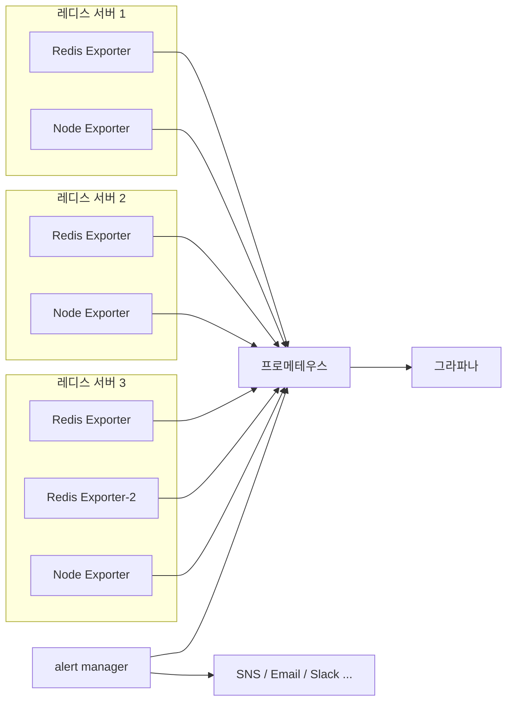
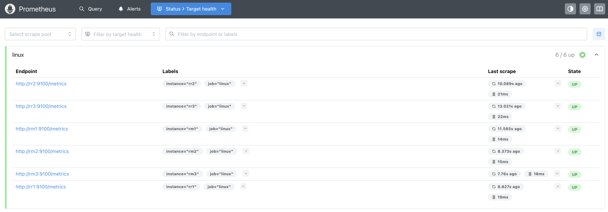
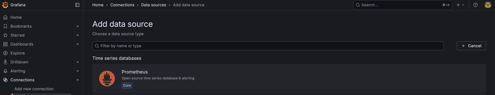
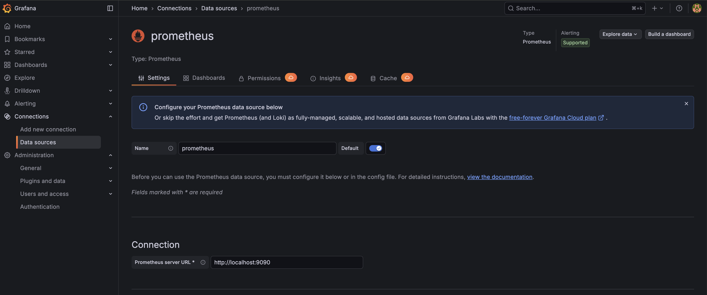
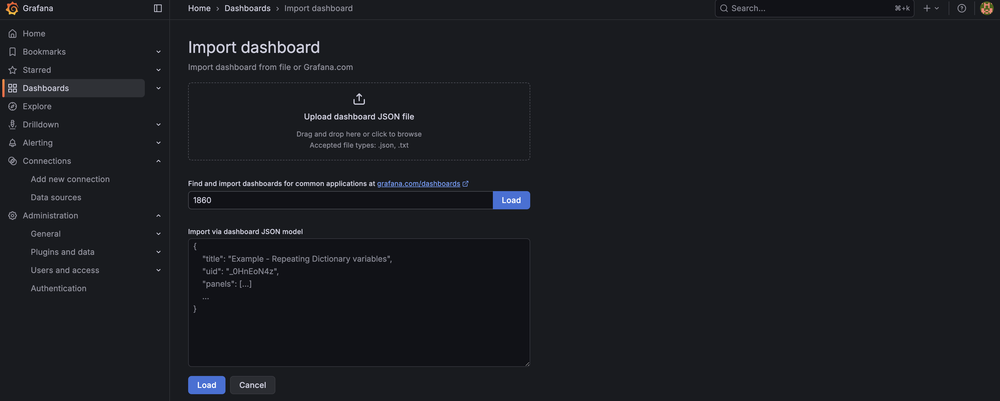
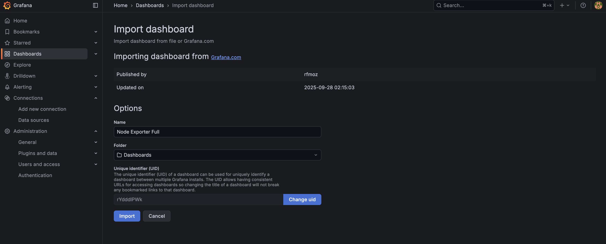
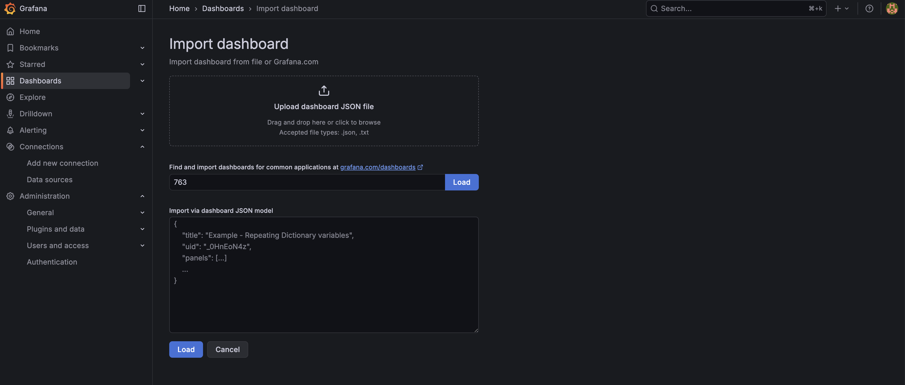
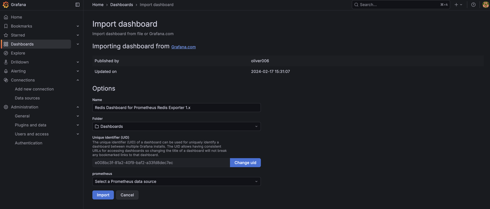
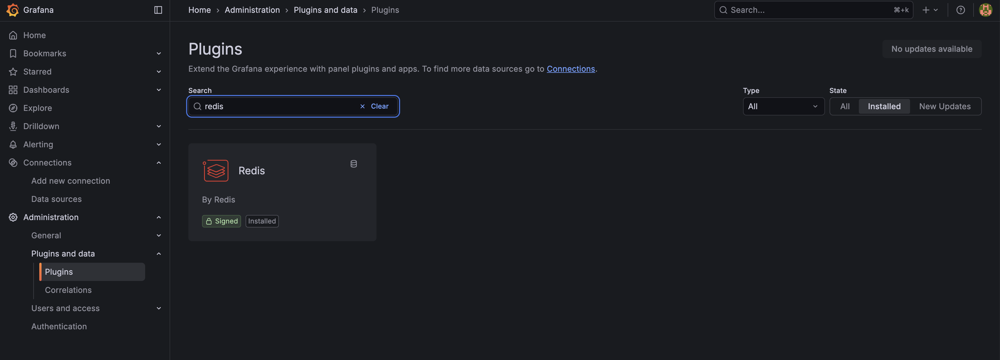
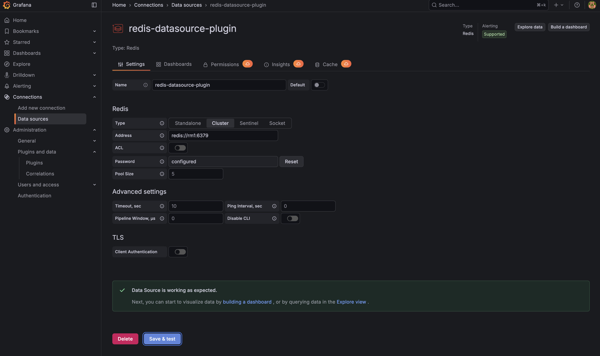

# Monitoring



Exporter
- 시스템의 상태를 실시간으로 스크립해서 메트릭을 수집하는 프로그램  

Redis Exporter
- 지정한 레디스 인스턴스의 실시간 정보를 수집

Node Exporter
- 레디스가 실행되는 서버의 하드웨어, OS 관련 메트릭 수집


## Node Exporter

[[github] node_exporter releases](https://github.com/prometheus/node_exporter/releases)

```bash
wget https://github.com/prometheus/node_exporter/releases/download/v1.10.2/node_exporter-1.10.2.linux-amd64.tar.gz

tar xvzf node_exporter-1.10.2.linux-amd64.tar.gz

ln -s node_exporter-1.10.2.linux-amd64/ node_exporter

cd node_exporter

nohup ./node_exporter > node_exporter.log &
```

```bash
curl localhost:9100
```

## Redis Exporter

[[github] redis_exporter releases](https://github.com/oliver006/redis_exporter/releases)

```bash
wget https://github.com/oliver006/redis_exporter/releases/download/v1.80.1/redis_exporter-v1.80.1.linux-amd64.tar.gz

tar xvzf redis_exporter-v1.80.1.linux-amd64.tar.gz

ln -s redis_exporter-v1.80.1.linux-amd64/ redis_exporter

cd redis_exporter

nohup ./redis_exporter > redis_exporter.log &
```

레디스 포트 변경등 수집되는 엔드포인트 정보 변경은 아래 플래그를 추가하여 변경한다  

ex)
```bash
nohup ./redis_exporter --redis.addr=redis://127.0.0.1:7379 --redis.password=password > redis_export.log &
```

| 플래그 이름            | 환경변수 이름                         | 설명 |
|------------------------|----------------------------------------|------|
| redis.addr             | REDIS_ADDR                             | 수집할 레디스의 주소, 기본은 redis://localhost:6379 |
| redis.user             | REDIS_USER                             | ACL 기능을 이용해 보안 관리를 할 때 사용할 수 있는 레디스 유저의 이름 |
| redis.password         | REDIS_PASSWORD                         | 레디스 인스턴스에 접근할 때 사용해야 하는 패스워드 |
| redis.password-file    | REDIS_PASSWORD_FILE                    | 레디스 인스턴스에 접근할 때 사용해야 하는 패스워드 파일 |
| web.listen-address     | REDIS_EXPORTER_WEB_LISTEN_ADDRESS      | 수집 정보를 확인할 수 있는 웹주소, 기본은 0.0.0.0:9121 |

```bash
curl localhost:9121/metrics
```

## Prometheus

[[github] prometheus releases](https://github.com/prometheus/prometheus/releases)

```bash
wget https://github.com/prometheus/prometheus/releases/download/v3.8.0/prometheus-3.8.0.linux-amd64.tar.gz

tar xvzf prometheus-3.8.0.linux-amd64.tar.gz

ln -s prometheus-3.8.0.linux-amd64/ prometheus

cd prometheus

vim prometheus.yml
```

```yml
# A scrape configuration containing exactly one endpoint to scrape:
# Here it's Prometheus itself.
scrape_configs:
  - job_name: redis
    static_configs:
      - labels:
          instance: 'rm1'
        targets:
          - 'rm1:9121'
      - labels:
          instance: 'rm2'
        targets:
          - 'rm2:9121'
      - labels:
          instance: 'rm3'
        targets:
          - 'rm3:9121'
      - labels:
          instance: 'rr1'
        targets:
          - 'rr1:9121'
      - labels:
          instance: 'rr2'
        targets:
          - 'rr2:9121'
      - labels:
          instance: 'rr3'
        targets:
          - 'rr3:9121'
  - job_name: linux
    static_configs:
      - labels:
          instance: 'rm1'
        targets:
          - 'rm1:9100'
      - labels:
          instance: 'rm2'
        targets:
          - 'rm2:9100'
      - labels:
          instance: 'rm3'
        targets:
          - 'rm3:9100'
      - labels:
          instance: 'rr1'
        targets:
          - 'rr1:9100'
      - labels:
          instance: 'rr2'
        targets:
          - 'rr2:9100'
      - labels:
          instance: 'rr3'
        targets:
          - 'rr3:9100'
```

```bash
nohup ./prometheus --config.file=prometheus.yml --storage.tsdb.path=./data --storage.tsdb.retention.time=30d --web.enable-lifecycle > prometheus.log &
```


```bash
curl localhost:9090
```



## Grafana

[[grafana] download oss releases](https://grafana.com/grafana/download?edition=oss)

```bash
wget https://dl.grafana.com/grafana/release/12.3.0/grafana_12.3.0_19497075765_linux_amd64.tar.gz

tar -zxvf grafana_12.3.0_19497075765_linux_amd64.tar.gz

ln -s grafana-12.3.0/ grafana

cd grafana

nohup ./bin/grafana-server start > grafana.log &
```

```bash
curl localhost:3000
```

초기 계정 admin/admin





https://grafana.com/grafana/dashboards/1860-node-exporter-full/





https://grafana.com/grafana/dashboards/763-redis-dashboard-for-prometheus-redis-exporter-1-x/





### [grafana redis plugin](https://redisgrafana.github.io/)

https://grafana.com/grafana/plugins/redis-datasource/?tab=overview

https://grafana.com/api/plugins/redis-datasource/versions/2.2.0/download

```bash
wget https://grafana.com/api/plugins/redis-datasource/versions/2.2.0/download -O redis-datasource-2.2.0.zip

unzip redis-datasource-2.2.0.zip

mv redis-datasource/ ~/grafana/data/plugins/
```




